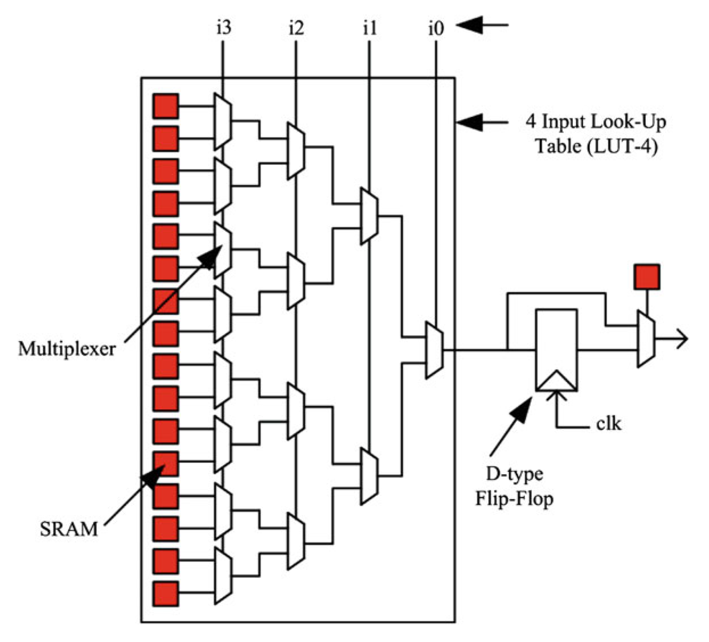
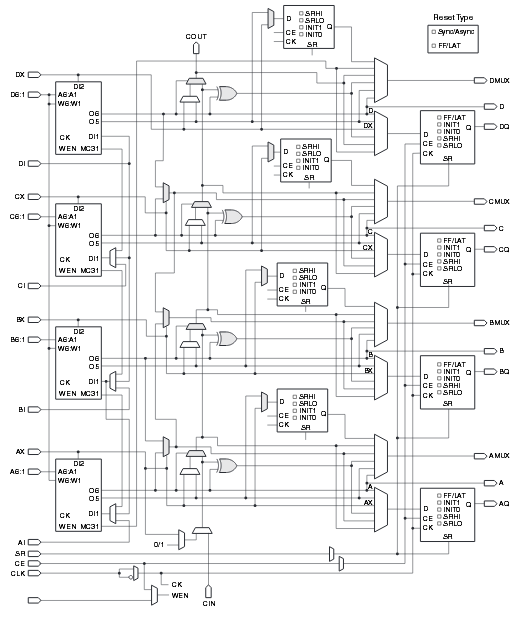
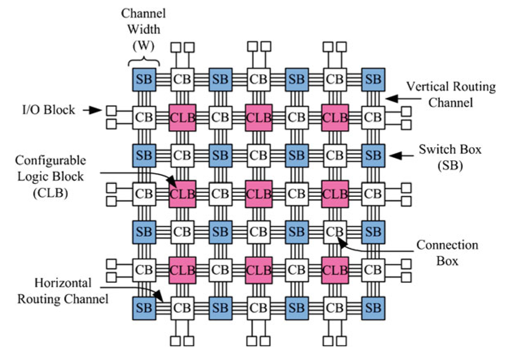
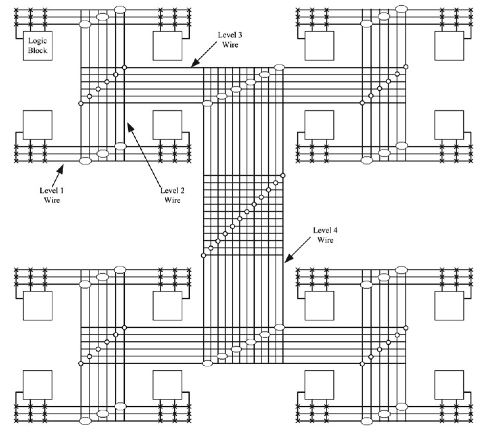
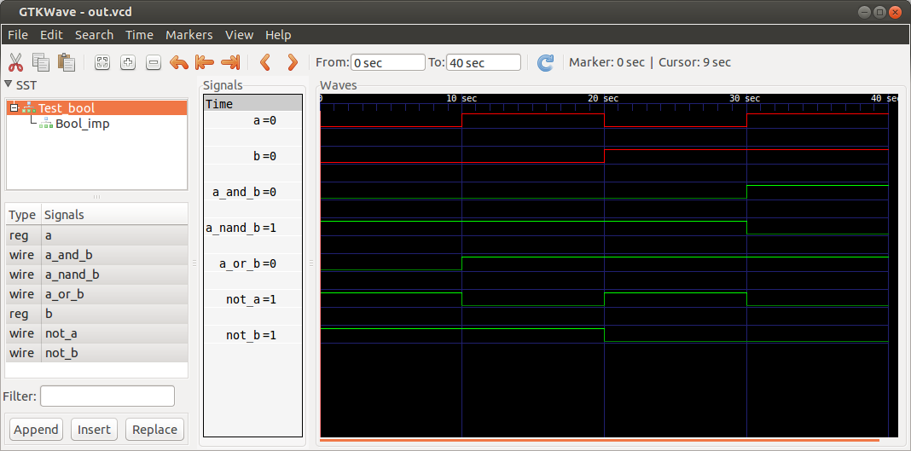

#Лекция 1. Что такое ПЛИС, начала Верилога

##Оглавление

- [Подготовка](#_2)
    - [Использование](#_3)
- [Что такое ПЛИС?](#_4)
    - [CPLD vs FPGA](#cpld-vs-fpga)
    - [Конфигурируемые логические блоки](#_5)
    - [Программируемые связи между логическими блоками](#_6)
    - [Программное обеспечение для проектирования ПЛИС](#_7)
- [Синтаксис](#_8)
    - [Комментарии](#_9)
    - [Числа](#_10)
    - [Регистры и цепи](#_11)
    - [Модули](#_12)

### Подготовка
Для симуляции схем, описанных с помощью верилога необходима программа [Icarus Verilog](http://iverilog.icarus.com/)
Версия для Windows: 

- [dev](http://bleyer.org/icarus/iverilog-20130827_setup.exe) 
- [stable](http://bleyer.org/icarus/iverilog-0.9.7_setup.exe)

Для Ubuntu/Debian доступны в репозитории пакеты `iverilog` и `gtkwave`

В состав программы входит пакет [GTKWave](http://gtkwave.sourceforge.net/) для просмотра временных диаграмм

После установки нужно убедиться, что в переменной `PATH` прописан путь к каталогам `C:\iverilog\bin` и `C:\iverilog\gtkwave`

### Использование
Компилирование:
```
iverilog -o result filename.v
```
Запуск на выполнение:
```
vvp result
```
Если есть dump file, то:
```
gtkwave dump_file_name.vcd
```
##Что такое ПЛИС?
Программи́руемая логи́ческая интегра́льная схе́ма (ПЛИС, англ. programmable logic device, PLD) — электронный компонент, используемый для создания цифровых интегральных схем. В отличие от обычных цифровых микросхем, логика работы ПЛИС не определяется при изготовлении, а задаётся посредством программирования (проектирования) (с) Wiki


Логика работы ПЛИС определяется не на фабрике изготовителем микросхемы, а путем дополнительного программирования (в полевых условиях, field-programmable) с помощью специальных средств: программаторов и программного обеспечения.

__Микросхемы ПЛИС – это не микропроцессоры__, в которых пользовательская программа выполняется последовательно, команда за командой. __В ПЛИС реализуется именно электронная схема, состоящая из логики и триггеров.__

Проект для ПЛИС может быть сделан как в виде принципиальной схемы, так и при помощи специальных языков описания аппаратуры:

- __VHDL__ — очень старый, но развивается, и по-прежнему очень популярен. Довольно громоздкий. Строгий, позволяет избежать многих ошибок. Похож на Паскаль
- __Verilog__ — новее, лаконичнее, свободнее. Легче делать ошибки. Тоже очень популярен. Похож на Си
- __SystemVerilog__ — расширенный вариант Verilog, ещё только набирает популярность, к тому же не поддерживается ПО Xilinx (Но для микросхем Xilinx с него всё же можно синтезировать с помощью сторонних программ, например Synplify). Раскрывает все свои прелести только на действительно больших проектах.
- __AHDL__ — только для микросхем фирмы Altera, к тому же довольно старый. Кажется, даже горячие поклонники Альтеры его уже по большей части забросили.

Выбор языка больше дело вкуса. Verilog популярен в коммерческих фирмах в США, а VHDL - у военных в США, в Европе и в России.

В любом случае, и графическое и текстовое описание проекта реализует цифровую электронную схему, которая в конечном счете будет «встроена» в ПЛИС.

Обычно, сама микросхема ПЛИС состоит из:

- конфигурируемых логических блоков, реализующих требуемую логическую функцию;
- программируемых электронных связей между конфигурируемыми логическими блоками;
 - программируемых блоков ввода/вывода, обеспечивающих связь внешнего вывода микросхемы с внутренней логикой.

Строго говоря это не полный список. В современных ПЛИС часто бывают встроены дополнительно блоки памяти, блоки DSP или умножители, PLL и другие компоненты. 

Разработчик проекта для ПЛИС обычно абстрагируется от внутреннего устройства конкретной микросхемы. Он просто описывает желаемую логику работы «своей» будещей микросхемы в виде схемы или текста на Verilog/ VHDL. Компилятор, зная внутреннее устройство ПЛИС сам пытается разместить требуемую схему по имеющимся конфигурируемым логическим блокам и пытается соединить эти блоки с помощью имеющихся программируемых электронных связей. В общем случае размещение и трассировка связей между логическими блоками в ПЛИС остается за компилятором.

###CPLD vs FPGA
В современных ПЛИС выделяют два вида: CPLD и FPGA

__CPLD__ (complex programmable logic device — сложные программируемые логические устройства) — ПЛИС, базовыми элементами которой являются макроячейки и простые логические вентили (И(-НЕ)/ИЛИ(-НЕ)). Обычно содержит меньше базовых элементов, чем FPGA, но является более быстродействующей. Также обычно __содержит энергонезависимую конфигурационную память прямо на кристалле__, но имеет ограниченное число циклов конфигурирования.

__FPGA__ (field-programmable gate array — Программируемая пользователем вентильная матрица) – ПЛИС, которые обычно имеют целый букет видов базовых блоков, это и настраиваемые логические элементы (таблицами истинности) и блоки сложения-умножения (Digital signal processing — DSP) и PLL (Phase-Locked Loop) для деления и умножения частоты и некоторые другие в зависимости от модели.__Обычно имеют энергозависимую внутреннюю память и функционал для загрузки конфигурации с внешней энергонезависимой памяти.__


###Конфигурируемые логические блоки.

В документации компании Альтера встречается выражение __Logic Array Block (LAB)__ – массив логики. У компании Xilinx в микросхемах ПЛИС есть примерно такие же блоки - __Configurable Logic Block (CLB)__. Конфигурируемый логический блок – это базовый элемент в ПЛИС, в нем может быть выполнена какая-то простая логическая функция или реализовано хранение результата вычисления в регистрах (триггерах).

__Сложность и структура конфигурируемого логического блока (CLB) определяется производителем.__

Теоретически, конфигурируемый логический блок может быть, например, очень простым, просто как отдельный транзистор. Или он может быть очень сложным, как целый процессор. Это крайние точки реализации.

В первом случае потребуется огромное число программируемых связей, чтобы потом из отдельных транзисторов собрать требуемую схему. Во втором случае связей может нужно и не так много, но теряется гибкость проектирования пользовательской схемы.

Именно поэтому конфигурируемый блок обычно представляет из себя что-то среднее: он обычно достаточно сложен, чтобы можно было бы зашить туда некоторую функцию, но и довольно мал, чтобы разместить множество таких блоков внутри ПЛИС и чтобы была возможность связать их в единую схему.

Таким образом, выбор структуры конфигурируемого логического блока производителем ПЛИС – это всегда поиск компромиса по площади кристалла, по быстродействию, энергопотреблению и так далее.

Конфигурируемый логический блок может состоять из одного или нескольких __базовых логических элементов__. В англоязычной литературе это __Basic Logic Element (BLE) или просто Logic Element  (LE).__ В ПЛИС обычно используются так называемые __LUT-based__ базовые логические элементы. Что-то вроде этого:



__LUT__ – это Look-Up Table, таблица преобразования. На рисунке показан четырехбитный LUT в составе базового логического блока. Здесь четырехбитному числу на входе логической функции ставится в соответствие однобитный результат. Красные квадратики обозначают программируемый элемент, регистр – это та память, где хранится прошивка для ПЛИС. Видно, что для конфигурации 4-х битного LUT требуется 16 конфигурационных регистров. Содержимое этих регистров определяют логическую функцию, реализованную внутри  базового логического элемента. 

Еще один конфигурационный регистр (одиночный красный квадратик справа) определяет нужно ли на выход базового логического элемента выдавать прямо значение с LUT или нужно выдать зафиксированное в D-триггере значение с LUT. Фиксация и хранение данных в цифровых схемах нужна практически в любом проекте.

__На самом деле базовый логический элемент в разных ПЛИС оказывается гораздо сложнее__. Базовый элемент Xilinx Virtex-6 Slice:


В одном CLB Virtex-6 имеется 8 LUT и 16 D-Триггеров и еще кое-что плюс к этому. Вот так все сложно.

###Программируемые связи между логическими блоками.

Чтобы в ПЛИС заработала нужная нам цифровая схема мало того, что нужно сконфигурировать имеющиеся логические блоки особым образом, еще нужно создать, запрограммировать связи между логическими блоками.

Для этого в ПЛИС имеются специальные конфигурируемые коммутаторы.

В англоязычной документации встречаются следующие термины: FPGA Routing Architecture и Programmable Routing Interconnect. Это все об этом, о программируемых связях между логическими блоками.

Известно две основных методики построения ПЛИС по типу архитектуры связей: островная и иерархическая.

__Островная ПЛИС__ называется так потому, что конфигурируемые блоки все равны между собой и находятся, как острова в океане, между узлами коммутации и линиями связи.



Обозначения: __CB – Connection Box__ и __SB – Switch Box__. В сущности это программируемые мультиплексоры, подключающие тот или иной CLB к другому CLB через цепочки проводов в ПЛИС.

Это __island-style FPGA__ или __mesh-based FPGA__. Типичный пример таких микросхем – это серии Altera Cyclone и Stratix.


Второй известный тип ПЛИС – это __иерархические ПЛИС__. Здесь идет расчет на то, что в схеме всегда есть участки которые взаимодействуют друг с другом более тесно, чем с отдаленными модулями проекта.



Здесь близлежащие CLB соединить довольно просто, нужно не много коммутаторов и получающиеся связи работают быстро. Вот если нужен более крупный блок вычислителей, то сигнал должен выйти на более высокий уровень иерархии и потом зайти вглубь в соседнюю «комнату».

###Программное обеспечение для проектирования ПЛИС

Программное обеспечение для проектирования ПЛИС, а именно __компилятор (синтезатор логики и фиттер и ассемблер)__ – это, возможно, самая сложная часть всей ПЛИС технологии.

Компилятор должен проанализировать пользовательский проект (схемы и текстовые описания на Verilog HDL или VHDL ) и сгенерировать __нетлист (netlist)__ – список всех элементов схемы и связи между ними. Netlist должен быть оптимизирован – логические функции нужно минимизировать, возможные дублированные регистры нужно удалить.

Затем компилятор должен вместить всю логику из netlist в имеющуюся архитектуру ПЛИС. Это делает __фиттер (fitter__, от глагола to fit - соотвествовать). Он размещает логические элементы и выполняет трассировку связей между ними (процесс place and route). Сложность состоит в том, что один и тот же проект может быть размещен в ПЛИС разными способами и этих способов миллионы. Некоторое размещение и трассировка оказываются лучше, другие хуже. Главный критерий качества полученной системы – максимальная частота, на которой сможет работать проект при данном размещении элементов и при данной трассировке связей. Здесь оказывает влияние длина связей между логическими блоками и количество программируемых коммутаторов между ними.

Компилятор, зная архитектуру ПЛИС по результатам работы дополнительно выдает отчет о времени прохождении сигналов от регистра до регистра. Эта информация часто бывает полезной для разработчика высокопроизводительных систем. Разработчик для ПЛИС имеет возможность давать некоторые советы компилятору где, в каком месте кристалла лучше разместить тот или иной модуль проекта.


##Синтаксис
####Комментарии
В языке Verilog приняты две формы для ввода комментариев. Однострочные
комментарии начинаются с символов `//` и заканчиваются концом строки.
Многострочные комментарии или иначе блочные комментарии начинаются с символов
`/*` и заканчиваются символами `*/`. Многострочные комментарии не могут быть
вложенными, но однострочный комментарий внутри блочного допустим.

####Числа
Числа или иначе константы могут определяться в десятичном, шестнадцатеричном,
восьмеричном или двоичном форматах. В языке Verilog предусмотрены две формы для
записи чисел. 

Первая форма представляет собой простое десятичное число как
последовательность цифр от 0 до 9 и опционально может предваряться символами
плюса или минуса. Вторая форма представления чисел имеет следующий формат:
`<size> <base_format> <number>`

Поле `size` содержит десятичные цифры и указывает разрядность константы в битах.
Это поле опционально и может опускаться. Если разрядность не
определена, то разрядность принимается по умолчанию равной 32 . 
Второе поле `base_format` содержит букву, определяющую формат представления числа. Эта буква предваряется символом одиночной кавычки `'`.
Формат представления определяется следующими буквами: 

- `d` – десятичный; 
- `h` –шестнадцатиричный; 
- `o` – восмеричный и 
- `b` – двоичный. 

Допускается вводить эти буквы как прописными, так и строчными. Последнее поле `number` содержит цифры допустимые для выбранного формата.

Помимо указанных цифр в поле `numbers` могут присутствовать буквы `x, X, z, Z` и символ (`?`) 
Буквы `x` и `X` обозначают __неизвестное (неопределенное) состояние__, т.е. состояние соответствующих битов неизвестно. 

Буквы `z` и `Z` обозначают __состояние высокого импеданса – z-состояние__ . 

Символ `?` эквивалентен символу `z` и предназначен для лучшей
читабельности кода в случаях когда это __состояние безразлично__ (don't-care). 

Можно использовать символ подчеркивания для улучшения читаемости. `8'b01100111` можно записать как `8'b0110_0111`. 

###Регистры и цепи
Сигналы – это электрические импульсы, которые передаются по проводникам (wires) между логическими элементами схемы. Проводники переносят информацию не производя над ней никаких вычислений. В цифровой схеме сигналы важны для передачи двоичных данных.

Один из базовых типов источника сигнала в языке Verilog – это __цепь или проводник, wire.__ Таким образом, если у вас есть арифметическое или логическое выражение, вы можете ассоциировать результат выражения с именованным проводником и позже использовать его в других выражениях. 

Это немного похоже на переменные, только их (как провода в схеме) нельзя пересоединить на лету, нельзя поменять назначение. __Значение проводника (wire) – это функция того, что присоединено к нему.__

Вот пример декларации однобитного проводника в программе, написанной на языке Verilog:

```Verilog
    wire a;
```
Вы можете ему назначить другой сигнал, скажем сигнал `b`, вот так:
 
```Verilog
    wire b;
    assign a = b;    
```

У вас могут быть проводники, передающие несколько битов:

```Verilog
wire [3:0] c; //это четыре провода
```
Проводники передающие несколько битов информации называются __“шина”__, иногда __“вектор”__. Следует обратить внимание на возрастание/убывание диапазона шины

```Verilog
   wire [7:0] data_A 
   wire [0:7] data_B

   data_A = 8’b10000000;
   data_b = 8’b10000000;

   data_A[0] // возвращает 0 (LSB - Least significant bit)
   data_B[0] // возвращает 1 (MSB - Most significant bit)
```

Количество проводников в шине определяется любыми двумя целыми числами разделенными двоеточием внутри квадратных скобок.

```Verilog
wire [11:4] e; //восьмибитная шина
wire [0:255] f; //256-ти битная шина
```

Из шины можно выбрать некоторые нужные биты и назначить другому проводу:
```Verilog
wire g;
assign g = f[2]; //назначить сигналу “g” второй бит шины “f”
```
Кроме того, выбираемый из шины бит может определяться переменной:
```Verilog
wire [7:0] h;
wire i = f[h]; // назначить сигналу “i” бит номер “h” из шины “f”
```
Вы можете выбрать из сигнальной шины некоторый диапазон битов и назначить другой шине с тем же количеством битов:
```Verilog
wire [3:0] j = e[7:4];
```
Так же, в большинстве диалектов Verilog, вы можете определить массивы сигнальных шин:
```Verilog
wire [7:0] k [0:19]; //массив из двадцати 8-ми битных шин
```

Еще существует другой тип источника сигнала называемый __регистр__: `reg`. Регистр reg в языке Verilog скорее обозначает переменную, которая может хранить значение, чем аппаратный регистр. Тип reg используют при поведенческом (behavioral) и процедурном описании цифровой схемы. Если регистру постоянно присваивается значение комбинаторной(логической) функции, то он ведет себя точно как проводник (wire). Если же регистру присваивается значение в синхронной логике, например по фронту сигнала тактовой частоты, то ему, в конечном счете, будет соответствовать физический D-триггер или группа D триггеров.

Регистры описываются так же, как и проводники:
```Verilog
reg [3:0] m;
reg [0:100] n;
```
Они могут использоваться, как и проводники - в правой части выражений, как операнды:
```Verilog
wire [1:0] p = m[2:1];
```
Вы можете определить массив регистров, которые обычно называют __“память”__:
```Verilog
reg [7:0] q [0:15]; //память из 16 слов, каждое по 8 бит
```

###Модули
Модуль Verilog - это основная структурная единица построения цифровой системы- по сути полный аналог физического модуля цифровой логики (logic gate). Черный ящик с ножками - на какие-то ножки (input) подается входной сигнал - параметры модуля, с других ножек (output) считывается выходной сигнал - результат работы модуля.

Определение любого модуля начинается с перечисления его входов (input) и выходов (output) в зависимости о того, что от этого модуля требуется.

Визуально с точки зрения синтаксиса в коде это выглядит почти как определение параметров для функции или переменных - роль переменной input/output + имя переменной ("физически" и по механизму работы это конечно же никакие не функции, а скорее классы или объекты, но не суть). Пример модуля:

```Verilog
module bool(
    input a, 
    input b,
    output not_a, 
    output not_b, 
    output a_and_b,
    output a_or_b, 
    output a_nand_b
    );

endmodule
```

В теле модуля входами и выходами можно оперировать примерно как переменными внутри привычной программы - переменным-выходам можно присваивать значения при помощи оператора assign - при этом значением может быть результат действия стандартных булевых операторов (или их комбинаций) над переменными-входами (или другими внутренними переменными или числовыми константами).

Каждый вход и выход в данном случае несет ровно 1 бит информации (1=TRUE, 0=FALSE).

```Verilog
module Bool(
    input a, 
    input b,
    output not_a, 
    output not_b, 
    output a_and_b,
    output a_or_b, 
    output a_nand_b
    );

assign not_a = ~a;           // NOT
assign not_b = ~b;           // NOT
assign a_and_b = a & b;      // AND
assign a_or_b = a | b;       // OR
assign a_nand_b = ~(a & b);  // NAND

endmodule
```
В проекте, особенно сложном, бывает много модулей, соединенных между собой. Прежде всего, нужно заметить, что обычно в проекте всегда есть __один модуль самого верхнего уровня (top level)__. Он состоит из нескольких других модулей. Те в свою очередь могут содержать еще модули и так далее. Не обязательно, чтобы все модули были написаны на одном языке описания аппаратуры. При синтезе для ПЛИС (FPGA) в качестве такого модуля верхнего уровня (top module) выбирается модуль, входами и выходами которого являются реальные устройства ввода/вывода, доступные на плате ПЛИС. 

Для симуляции, в качестве модуля верхнего уровня будет использоваться __тестовый модуль (testbanch)__, который будет генерировать сигналы для входящих в него модулей.

```Verilog
module Test_bool;

reg a, b;
wire not_a, not_b, a_and_b, a_or_b, a_nand_b;

//устанавливаем экземпляр тестируемого модуля
Bool Bool_imp(a, b, not_a, not_b, a_and_b, a_or_b, a_nand_b);

//от начала времени...
initial
begin
    a = 0;
    b = 0;

    //через временной интервал "10"
    #10 a = 1;
    b = 0;

    #10 a = 0;
    b = 1;

    #10 a = 1;
    b = 1;
end

//создаем файл VCD для последующего анализа сигналов
initial
begin
  $dumpfile("out.vcd");
  $dumpvars(0, Test_bool);

  //заканчиваем симуляцию в момент времени "40"
  #40 $finish;
end
endmodule
```
Модуль готов, теперь можно воспользоваться программным симулятором для проверки работы.

Оба модуля можно описать в одном файле, например `bool.v`
Компилирование:
```
iverilog -o result bool.v
```
Запуск на выполнение:
```
vvp result
```
Просмотр временных диаграмм:
```
gtkwave out.vcd
```



##Ссылки
- [Лабораторная работа2: знакомство с платой ПЛИС (FPGA) - основы комбинаторной логики (1)](http://1i7.livejournal.com/2414.html)
- [Симуляция проекта с помощью Icarus-Verilog ](http://marsohod.org/index.php/ourblog/11-blog/113-icarus)
- [Введение в Verilog, Первый урок](http://marsohod.org/index.php/ourblog/11-blog/77-veriloglesson1)
- [Архитектура ПЛИС (FPGA) ](http://marsohod.org/index.php/ourblog/11-blog/265-fpga)
- [Николай К. Введение в Verilog – язык описания цифровых схем](http://www.google.ru/url?sa=t&rct=j&q=&esrc=s&source=web&cd=1&cad=rja&uact=8&ved=0CB4QFjAA&url=http%3A%2F%2Fmarsohod.org%2Findex.php%2Fdownloads%2Fdoc_download%2F37---verilog&ei=NVEsVJqXK-HjywOalYLQDw&usg=AFQjCNFC-3UsUmz6cv4_2JHMrU5SifQx0Q&sig2=U5OQFQI91sGHZXjH9B0EVQ&bvm=bv.76477589,d.bGQ)
- [Автоматизация проектирования электронных приборов ](http://1i7.livejournal.com/1583.html#comments)
- [Букварев Е. A. Язык Verilog](http://irs.nntu.ru/globals/files/bukvarev/verilog.pdf)
- [Digital Design and Computer Architecture David Money Harris & Sarah L. Harris](http://www.amazon.com/Digital-Design-Computer-Architecture-Edition/dp/0123944244)
