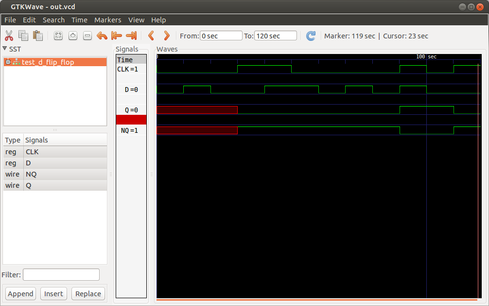

[Лекция 1](https://github.com/dep403mai/Hardware_description_language/tree/master/lecture1)
# Лекция 2. Триггеры

##Оглавление

- [НЕ, И-НЕ, ИЛИ-НЕ](#НЕ-И-НЕ-ИЛИ-НЕ)
- [RS защелка](#rs-защелка)
- [D защелка (D latch)](#d-защелка-d-latch)
- [D триггер](#d-триггер)


Существует два вида логики: комбинационная логика (combinational logic) - все входы системы каким-то образом комбинируются при помощи логических операций и дают некий выходной результат - состояние всех выходов системы зависит только от текущих значений входов системы. 
Секвенциальная (или последовательная) логика (sequential logic) - выходной результат зависит не токлько от комбинации входных сигналов, но и от состояния элемента. Триггеры относятся к элементом последовательной логики

###НЕ, И-НЕ, ИЛИ-НЕ

Если входное сопротивление `Vm` ниже определенного критического значения, транзистор выключается и действует как большое сопротивление, следовательно выходной сигнал `Vout` становится близким к `Vcc` (логическая 1). Если `Vm` превышает критическое значение, транзистор выключается и действует как проводник, "закорачивая" `Vcc` и `Vout` на землю (логический 0).


Два транзистора соеденены последовательно, Если напряжение `V1` и `V2` высокое, оба транзистора становятся проводниками и снижают `Vout`, если одно из входных напряжений низкое, то соотвествующий транзистор выключается и напряжение на выходе становиться высоким. Напряжение `Vout` является низким тогда и только тогда, когда оба напряжение `V1` и `V2` высокие.


Транзисторы подключены параллельно, Если один из входных сигналов высокий, включается соотвествующий транзистор и снижает выходной сигнал, если оба напряжения на входе низкие, то выходное напряжение становится высоким.


### RS защелка


1.  `R = 0, S = 0`: Очевидно, что оба выхода `Q` и `~Q` на схеме будут равны `1`, т.к. для обоих NAND'ов для выдачи значения `1` на выход достаточно подать `0` хотябы на одну входящую ножку, а промежуточные обратные связи между NAND'ами при такой схеме роли не играют. Подобное состояния не интересно с точки зрения функционала защелки и считается некорректным. __Итого__: `Q = 1`, `~Q = 1`.
2.  `R = 0`, `S = 1`: Выход `Q` будет равен `1`, т.к. для этого достаточно подать значение `0` на любую ножку его NAND'а (что мы и сделали, подав `0` на R), значение 2-й "зацикленной" ножки роли не играет. Для `~Q` смотрим дальше - 1-я ножка его NAND'а `S = 1`, т.е. по таблице истинности NAND финальное значение оператора может быть как `0`, так и `1` и будет зависеть от значения 2-й входной ножки. Смотрим, чему равно значение 2-й ножки - оно равно результату работы 1-го оператора NAND `Q`, который как только что выяснили обязательно равен `1`. Итого получаем на втором операторе NAND два входа `1` и `1` - итоговое значение `~Q = 0`. __Итого__: `Q = 1`, `~Q = 0`.
3.  `R = 1`, `S = 0`: Цепочка рассуждений зеркальна пункту 2. __Итого:__ `Q = 0`, `~Q = 1`.
4.  `R = 1`, `S = 1`: Самая интересная ситуация, которая собственно и определяет полезность этой RS защелки как модуля памяти. Судя по таблице истинности, финальные значения `Q` и `~Q`  не могут быть определены, основываясь только на значениях R и S, если они оба равны `1`, т.к. и для верхнего и для нижнего NAND'а требуется знать значение "зацикленной" ножки, но верхний NAND может получить его только от нижнего NANA'а (значение `~Q`), а нижний NAND может получить его только от верхнего NAND'а (`Q`). Поэтому для решения это проблемы требуется рассмотреть ситуацию, которая произошла "за мгновение" до перехода в состояние в текущее состояние `R = 1`, `S = 1`.
    4.   Если значение R было равно `0` (S так и было `1`), то значение `Q` было равно `1`, т.е. "зацикленный" вход нижнего NAND'а был тоже равен `1`, соответственно выход `~Q` нижнего NAND'а равнялся `0` (полностью повторение ситуации 2). Теперь если мы из этого положения переходим в состояние 4, т.е. переносим вход R с `0` на `1`, это ситуацию ни коим образом не меняет, т.к. "зацикленный" вход верхнего NAND'а равен `~Q = 0`, а это значит, что выход `Q` по таблице истинности все равно будет равен 1 вне зависимости от значения R, т.е. мы попали в начало цепочки 4.1 (или 2 - не важно), только с другим значением R. __Итого:__ `Q = 1`, `~Q = 0`.
    4.   Значение S было равно 0 (R так и было 1): зеркально предыдущему пункту __Итого:__ `Q = 0`, `~Q = 1`.


В итоге мы получили, что в состоянии 4, когда и `R = 1` и `S = 1`, система находится в стабильном состоянии, которая она запомнила с прошлого раза. Т.к. вариантов различных стабильных состояний всего 2 ("Q=1, ~Q=0" или "Q=0, ~Q=1"), то можно считать, что такая система может запоминать один бинарный бит информации (Q=1 или Q=0, ~Q вообще говоря можно отбросить), который устанавливается в 1 и сбрасывается в 0 через входы R и S соответственно (отсюда название защелки RESET и SET ... R и S при желании можно поменять местами).


####Реализация RS-защелки на верилоге
```Verilog
module RS_latch(
    input wire S,
    input wire R,
    output wire Q,
    output wire NQ
    );

assign Q = ~(R & NQ);
assign NQ = ~(S & Q);

endmodule


module test_rs;

reg S, R;
wire Q, NQ;

RS_latch rs_imp(S, R, Q, NQ);

initial
begin
    S = 0; R = 0;

    #10 S = 1; R = 0;

    #10 S = 0; R = 1;

    #10 S = 1; R = 0;

    #10 S = 1; R = 1;

    #10 S = 0; R = 0;
end

initial
begin
  #60 $finish;
end

initial
begin
    $dumpfile("out.vcd");
    $dumpvars(0, test_rs);
end

endmodule
```

Часто бывает удобно, что бы состояние защелки изменялось в определенные моменты времени


###D защелка (D latch) 
Чтобы предотвратить неопределенность RS защелки в случае `R = S = 1` нужно предотвратить ее возникновение.

Защелка состоит из 2х операторов AND, одного оператора NOT и одной NOR-RS-защелки. Управляющих входа в схему  опять два, но их роль уже другая. Вход D задает значение, которое может быть сохранено в схеме, вход CLK открывает защелку на прием значения с D или закрывает ее так, чтобы она сохранила последнее значение и вход D на него больше не влиял.

1. `CLK=1, D=0`: верхний AND на входе получает 1 и 1 => R получает 1; нижний AND получает 1 и 0 => S пулучает 0. Получаем ситуацию R=1, S=0 => Q=0, ~Q=1 (см объяснения из упражнения 1 с поправкой на таблицу истинности NOR для упражнения 2) => произошла запись в RS защелку значения 0 (будем считать, что текущее значение защелки это значение выхода Q, ~Q - просто инверсия). За текущее значение D защелки принимаем текущее значени RS защелки.

2. `CLK=1, D=1`: зеркально предыдущему случаю - в D защелку записали значение 1.

3. `CLK=0, D=0/1`: Т.к. значение CLK=0, очевидно оба значения выходов-входов R и S равны 0 (действие операторов AND), т.е. RS защелка находится в состоянии запоминания последнего установленного в нее значения, новые значения из D просто никак не влияют на схему, т.е. не принимаются.

Итого получаем:
CLK=1: защелка находится в __прозрачном (transparent) состоянии__ - данные идут от D к Q.
CLK=0: защелка находится в __непрозрачном (opaque) состоянии__ - данные от D к Q не идут, защелка сохраняет установленное значение.

Как видно, преимуществом D защелки заключается как минимум уже в том, что для изменения текущего сохраненного значения используется всего один входной сигнал. Второй управляющий сигнал используется для перевода схемы из состояния "открыто для получения нового значения" (прозначна) в состояние "закрыто - последнее значение сохранено" (непрозрачна) и обратно. При этом любые комбинации состояний входных сигналов защелки являются корректными.

```Verilog
module RS_latch(
    input wire S,
    input wire R,
    output wire Q,
    output wire NQ
    );

assign Q = ~(R | NQ);
assign NQ = ~(S | Q);

endmodule


module D_latch(
    input wire CLK,
    input wire D,
    output wire Q,
    output wire NQ
    );
wire R, S;
assign R = CLK & ~D;
assign S = D & CLK;

RS_latch rs_imp(S, R, Q, NQ);

endmodule


module test_d_latch;

reg D, CLK;
wire Q, NQ;

D_latch d_imp(CLK, D, Q, NQ);


initial
begin
    D = 0; CLK = 0;

    #10 D = 1; 

    #10 D = 0;

    #10 CLK = 1;

    #10 D = 1;

    #10 CLK = 0;

    #10 D = 0;

    #10 D = 1;
end

initial
begin
  #80 $finish;
end

initial
begin
    $dumpfile("out.vcd");
    $dumpvars(0, test_d_latch);
end

endmodule
```


###D триггер
Особым образом совмещаем на схеме 2 D защелки - получаем __D триггер (D flip-flop).__ Левую D защелку назовем __хозяин (master),__ правую - __раб (slave).__

Сигнал CLK к обеим защелкам подключен один и тот же, только в одну из защелок он поступает в инвертированном состоянии, т.е. в каждый момент времени одна защелка является прозрачной, а вторая непрозрачной и наоборот. Входной сигнал D, несущий внешнее устанавлимое значение, входит в левую D защелку master; выход R левой защелки master подключен к входу D правой защелки slave. За текущее значение D триггера принимаем значение правой защелки slave.

Таким образом, если вникнуть в эту схему, то можно понять, что входной сигнал D может передать свое значение в определяющую значение D триггера защелку slave только пройдя через буферную защелку master. Для этого нужно:

1. Сначала защелку master сделать прозрачной (CLK=0) так, что она начнет принимать входящий сигнал D - защелка slave при этом будет непрозрачной, поэтому дальше защелки master в этот момент сигнал D не проберется.

2. Когда нужное значение в защелку master установлено, делаем прозрачной уже защелку slave (CLK=1) - значение переходит из защелки master в защелку slave - значение триггера установлено. При этом важно, что в этот же момент сама защелка master переходит из прозрачного в непрозрачное состояние, поэтому процессу передачи значения master->slave внешний сигнал D помешать не может.

Таким образом получается, что запись в D триггер происходит только на ребре (edge) сигнала CLK именно в тот момент, когда он переходит из состояния LOW (0) в HIGH (1) - после этого внешний сигнал D никак повлиять на значение триггера не может.

```Verilog
module RS_latch(
    input wire S,
    input wire R,
    output wire Q,
    output wire NQ
    );

assign Q = ~(R | NQ);
assign NQ = ~(S | Q);

endmodule


module D_latch(
    input wire CLK,
    input wire D,
    output wire Q,
    output wire NQ
    );
wire R, S;
assign R = CLK & ~D;
assign S = D & CLK;

RS_latch rs_imp(S, R, Q, NQ);

endmodule


module D_flip_flope(
    input wire CLK,
    input wire D,
    output wire Q,
    output wire NQ
    );

wire connect;

D_latch d_master(~CLK, D, connect, );
D_latch d_slave(CLK, connect, Q, NQ);

endmodule


module test_d_flip_flop;

reg D, CLK;
wire Q, NQ;

D_flip_flope d_imp(CLK, D, Q, NQ);


initial
begin
    D = 0; CLK = 0;

    #10 D = 1; 

    #10 D = 0;

    #10 CLK = 1;

    #10 D = 1;

    #10 CLK = 0;

    #10 D = 0;

    #10 D = 1;

    #10 CLK = 0;
    #0 D = 0;

    #10 D = 1;
    #0 CLK = 1;

    #10 D = 0;
    #0 CLK = 0;

    #10 D = 0;
    #0 CLK = 1;
end

initial
begin
  #120 $finish;
end

initial
begin
    $dumpfile("out.vcd");
    $dumpvars(0, test_d_flip_flop);
end

endmodule
```

Такой механизм позволяет например сделать процесс подачи нового значения в несколько триггеров одновременно более предсказуемым. Допустим, у нас есть несколько однобитных триггеров и мы хотим в них записать какое-то двоичное значение. Конкретный момент появления текущих значений на входных сигналах каждого триггера в общем случае непредсказуем и в случае набора открытых D защелок они могли бы случайным образом асинхронно менять (по сути повредить) их внутреннюю память до того момента, как защелка не захлопнулась. При добавлении буферной зоны из дополнительной D защелки master, непредсказуемость подобного поведения обрезается - если все триггеры подключены к одному и тому же управляющему сигналу (который закрывает и открывает триггер), все значения из буферных защелок отправятся во внутренние значимые защелки одновременно. 
