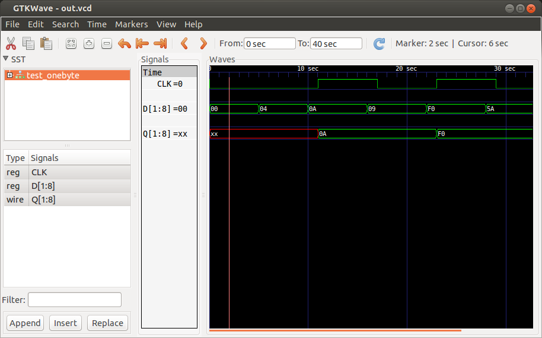
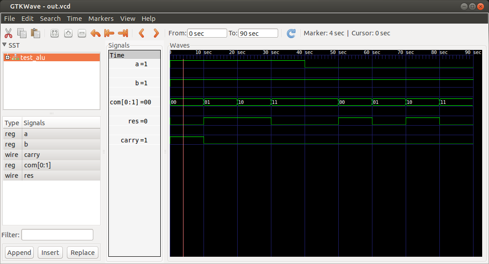

# Лекция 3. 
## Построение 8 разрядного регистра (1 байт памяти) из 8 D триггеров


```Verilog
module RS_latch(
    input wire S,
    input wire R,
    output wire Q,
    output wire NQ
    );

assign Q = ~(R | NQ);
assign NQ = ~(S | Q);

endmodule


module D_latch(
    input wire CLK,
    input wire D,
    output wire Q,
    output wire NQ
    );
wire R, S;
assign R = CLK & ~D;
assign S = D & CLK;

RS_latch rs_imp(S, R, Q, NQ);

endmodule


module D_flip_flope(
    input wire CLK,
    input wire D,
    output wire Q,
    output wire NQ
    );

wire connect;

D_latch d_master(~CLK, D, connect, );
D_latch d_slave(CLK, connect, Q, NQ);

endmodule

module OneByte(    
    input wire CLK,
    input wire [1:8]D,
    output wire [1:8]Q
    );

D_flip_flope D1(CLK, D[1], Q[1], );
D_flip_flope D2(CLK, D[2], Q[2], );
D_flip_flope D3(CLK, D[3], Q[3], );
D_flip_flope D4(CLK, D[4], Q[4], );
D_flip_flope D5(CLK, D[5], Q[5], );
D_flip_flope D6(CLK, D[6], Q[6], );
D_flip_flope D7(CLK, D[7], Q[7], );
D_flip_flope D8(CLK, D[8], Q[8], );

endmodule


module test_onebyte;

reg [1:8]D;
reg CLK;
wire [1:8]Q;

OneByte reg_imp(CLK, D, Q);


initial
begin
    D = 8'h0; 
    CLK = 0;

    #5 D = 8'h4;

    #5 D = 8'hA;
    #1 CLK = ~CLK; 

    #5 D = 8'h9;
    #1 CLK = ~CLK; 

    #5 D = 8'b1111_0000;
    #1 CLK = ~CLK;

    #5 D = 8'b0101_1010;
    #1 CLK = ~CLK; 

end

initial
begin
  #40 $finish;
end

initial
begin
    $dumpfile("out.vcd");
    $dumpvars(0, test_onebyte);
end

endmodule
```


## Реализация АЛУ с 4-я командами

```
Двоичный код | Унитарный | Функция
команды      | код       |
-----------------------------------
   00        |   0001    |   NOT_B
   01        |   0010    |   A_OR_B
   10        |   0100    |   A_AND_B
   11        |   1000    |   SUM
```

```Verilog
module Command_decoder(
    input wire [0:1]COMMAND,
    output wire [0:3]Q
    );

// 00 -> 0001  -> NOT_B
// 01 -> 0010  -> A_OR_B
// 10 -> 0100  -> A_AND_B
// 11 -> 1000  -> SUM

assign Q[0] = COMMAND[0] & COMMAND[1];
assign Q[1] = COMMAND[0] & ~COMMAND[1];
assign Q[2] = ~COMMAND[0] & COMMAND[1];
assign Q[3] = ~COMMAND[0] & ~COMMAND[1];

endmodule


module Sum(
    input wire ENABLE,
    input wire A,
    input wire B,
    output wire SUM,
    output wire CARRY
    );

assign {CARRY, SUM} = ((ENABLE & A) + (ENABLE & B));

endmodule

module Logic_unit(
    input wire [0:2]COMMAND,
    input wire A,
    input wire B,
    output wire NOT_B,
    output wire A_OR_B,
    output wire A_AND_B
    );

assign NOT_B =  COMMAND[0] & (~B);

assign A_OR_B = ((COMMAND[1] & A) | (COMMAND[1] & B));

assign A_AND_B = ((COMMAND[2] & A) & (COMMAND[2] & B));

endmodule


module Alu(
    input wire A,
    input wire B,
    input wire [0:1]COMMAND,
    output wire RES,
    output wire CARRY
    );


wire [0:3]Q;
wire NOT_B, A_AND_B, A_OR_B, SUM;

Command_decoder com_imp(COMMAND, Q);
Sum sum_imp(Q[3], A, B, SUM ,CARRY);
Logic_unit logic_imp(Q[0:2], A, B, NOT_B, A_OR_B, A_AND_B);

assign RES = NOT_B | A_AND_B | A_OR_B | SUM;
endmodule

module test_alu;

reg [0:1]com;
reg a,b;
wire res, carry;

Alu alu_imp(a, b, com, res, carry);


initial
begin
   a = 1;
   b = 1;
   com = 2'b00;

   #10 com = 2'b01;

   #10 com = 2'b10;

   #10 com = 2'b11;

   #10 a = 0;
   b = 1;

   #10 com = 2'b00;

    #10 com = 2'b01;

   #10 com = 2'b10;

   #10 com = 2'b11;

end

initial
begin
  #90 $finish;
end

initial
begin
    $dumpfile("out.vcd");
    $dumpvars(0, test_alu);
end

endmodule
```


