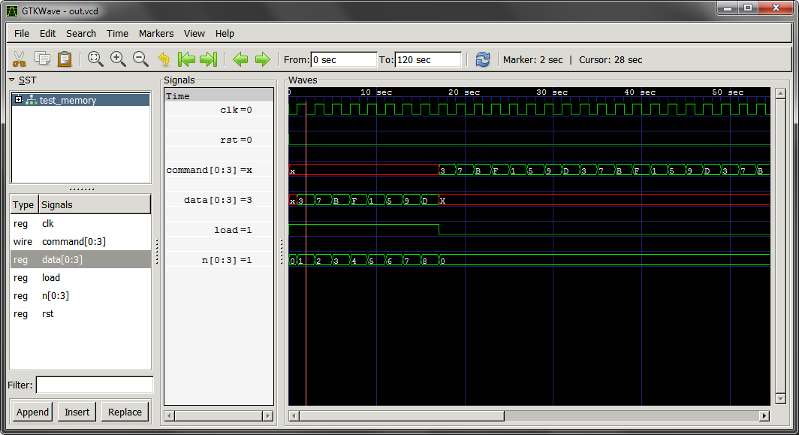
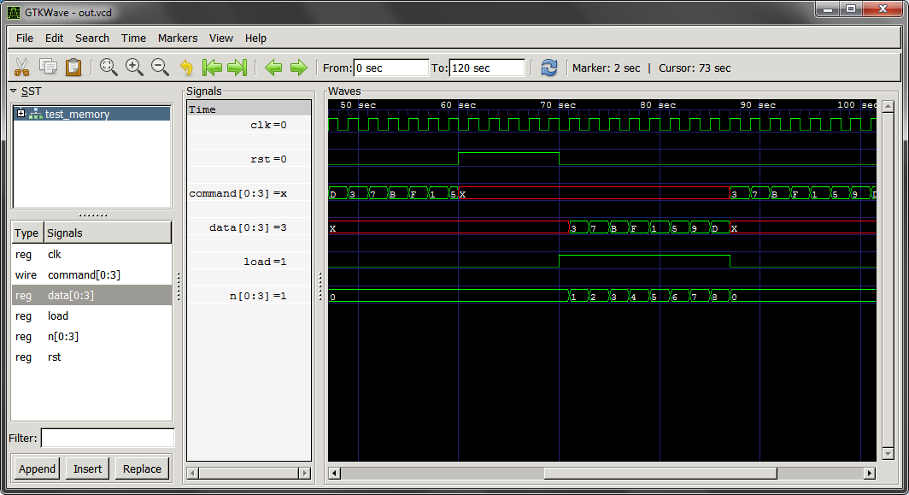
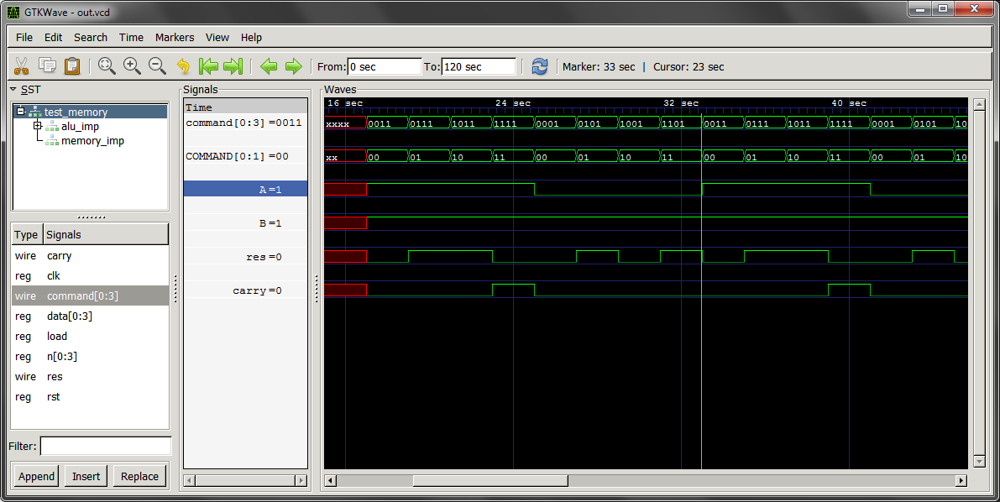

# Лекция 4 Поведенческое описание. 
До сих пор мы рассматривали только структурную логику на Verilog, когда поведение схемы определяется только один раз, и эта схема не изменяется в зависимости от входных состояний (меняется только выходное значение в соответствии со спроектированной цепью). 

Чтобы сделать язык Verilog более выразительным, он имеет так называемые "always" блоки. Они используются при описании системы с помощью __поведенческих блоков (behavioral blocks)__. Использование поведенческих блоков очень похоже на программирование на языке С. Оно позволяет выразить алгоритм так, чтобы он выглядел как последовательность действий (даже если в конечном счете в аппаратуре это будет не так).

## Always - блоки
Для описания поведенческого блока используется вот такой синтаксис:

```Verilog
always @(<sensitivity_list>) <statements>
```

`<sensitivity_list>` – это список всех входных сигналов, к которым чувствителен блок. Это список входных сигналов, изменение которых влияет выходные сигналы этого блока. "Always" переводится как "всегда". Такую запись можно прочитать вот так: "Всегда выполнять выражения `<statements>` при изменении сигналов, описаных в списке чувствительности `<sensitivity list>`".

Если указать список чувствительности неверно, то это не должно повлиять на синтез проекта, но может повлиять на его симуляцию. В списке чувствительности имена входных сигналов разделяются ключевым словом __or__:
`always @(a or b or d) <statements>` 

Иногда гораздо проще и надежней включать в список чувствительности все сигналы. Это делается вот так:
`always @* <statements>` Тогда исправляя выражения в  `<statements>` вам не нужно задумываться об изменении списка чувствительности.

__При описании выражений внутри поведенческих блоков комбинаторной логики, с правой стороны от знака равенства, как и раньше, можно использовать типы сигналов wire или reg, а вот с левой стороны теперь используется только тип reg:__

```Verilog
reg [3:0] c;
always @(a or b or d)
begin
c = <выражение использующее входные сигналы a,b,d>;
end
```

Теперь можно делать очень интересные вещи, такие как условные переходы, множественный выбор по условию, циклы и прочее.

### Простой мультиплексор
Например, мы уже знаем как описать простой мультиплексор с помощью оператора __"?",__ вот так:

```Verilog
reg [3:0] c;
always @(a or b or d)

begin
c = d ? (a & b) : (a + b);
end
```

А теперь можем написать это же, но по другому:

```Verilog
reg [3:0] c;
always @(a or b or d) begin
   if (d) begin
     c = a & b;
   end else begin
     c = a + b;
   end
end
```

### Простой декодер
Если нужно сделать выбор из многих выриантов (это на языке схемотехники мультиплексор со многими входами), то можно использовать конструкцию __case__. Конструкции case очень похожи на switch из языка C.

Базовый синтаксис вот такой:
```Verilog
case (selector)
  option1: <statement>;
  option2: <statement>;
  default:  <if nothing else statement>;  //по желанию, но желательно
endcase 
```

А вот и простой пример:

```Verilog
wire [1:0] option;
wire [7:0] a, b, c, d;
reg [7:0] e;
always @(a or b or c or d or option) begin
case (option)
 0: e = a;
  1: e = b;
  2: e = c;
  3: e = d;
endcase
end
```

### Структура if/else
Данная структура представляет полезный инструмен для описания схем. Существуют несколько правил:

- Все if/else блоки должны распологаться внутри always блока
- Все значения, устанавливаемые внутри конструкции, должны иметь тип reg

пример:
```Verilog
...
reg [0:2]a;
always @(INPUT) begin
    if(a == 7) begin
        <statements>
    end
    else begin

    end
end
```

## Синхронная логика
Описание синхронной логики в поведенческом коде Verilog очень похоже на описание комбинаторной логики с одним важным отличием – в списке чувствительности always блока теперь будут не сами сигналы, __а фронт тактовой частоты clock__. Только в этом случае регистры, которым идет присвоение, будут реализованы в виде D-триггеров (flipflops).

```Verilog
...
input clock;
input [7:0] data;

reg [7:0] q;

always @(posedge clock) begin
    q <= data;
end
endmodule
```
Здесь блок always чувствителен к фронту тактовой частоты: __posedge__ clock. Еще, вместо __posedge__ – положительного фронта тактовой частоты можно использовать __negedge__ – отрицательный фронт. При использовании negedge запоминание в регистр происходит по перепаду сигнала clock с «1» в «0».

Очень часто модули имеют дополнительные сигнал сброса. Они используются чтобы установить триггера схемы в некоторое исходное состояние. Сигналы сброса могут быть разных типов: __синхронные и ассинхронные__

Пример синхронного сброса:
```Verilog
always @(posedge clock) begin
  if (reset) begin
    q <= 0;
  end else begin
    q <= data;
  end
end
```

Пример асинхронного сброса
```Verilog
always @(posedge clock or posedge reset) begin
  if (reset) begin
    q <= 0;
  end else begin
    q <= data;
  end
end 
```

##Реализация элемента памяти емкостью 8 4-х разрядных слов с блоком загрузки команд и циклической выдачи

```Verilog
module Memory(
    input wire CLK,                 // Тактирование
    input wire LOAD,                // Сигнал разрешения рагрузки
    input wire RST,                 // Сброс
    input wire [0:3]INPUT_DATA,     // Шина входных слов
    output reg [0:3]OUTPUT_COMMAND  // Шина выходных слов
    );

reg [0:3]memory[0:7];       // Внутренняя память (ОЗУ)
reg [0:2] input_count = 0;  // Счетчик количества считанных слов
integer i = 0;
reg [0:2] output_count = 0; // Счетчик количества выданных слов

always @(posedge CLK or posedge RST) begin

    if (RST) begin      // Очищаем все регистры
        for (i = 0; i < 8; i = i + 1) memory[i] = 3'hx;
        OUTPUT_COMMAND = 3'hx;
        output_count = 0;
        input_count = 0;
    end

    else begin          // Cчитываем с входной шины слова в память
        if (LOAD) begin
            if (input_count != 8) begin
                memory[input_count] = INPUT_DATA;
                input_count = input_count + 1;
            end
        end

        else begin      // Считываем слова из памяти
            OUTPUT_COMMAND = memory[output_count];
            if (output_count > 7) begin
                output_count = 0;
            end

            else begin
                output_count = output_count + 1;
            end
        end // end of else if (LOAD)
    end // end of else if (RST)
end // end of always @(posedge CLK or posedge RST)
endmodule // end of module Memory

module test_memory;
reg clk;
reg load;
reg rst;
reg [0:3]a[0:7];
reg [0:3]data;
wire [0:3]command;
reg [0:3]n;

Memory memory_imp(clk, load, rst ,data, command);

initial begin
// a[0]=4'b0011;
// a[1]=4'b0111;
// a[2]=4'b1011;
// a[3]=4'b1111;

// a[4]=4'b0001;
// a[5]=4'b0101;
// a[6]=4'b1001;
// a[7]=4'b1101;

$readmemb("program.bin", a);
end

always begin
    #1 clk = ~clk;
end

initial begin
 clk = 0;
 load = 1;
 rst = 0;
 n = 0;

 #60 rst = 1;

 #10 rst = 0;
 load = 1;
end

always @(posedge clk) begin
    if (load) begin
        data = a[n];

        if (n > 7) begin
            load = 0;
            n = 0;
            data = 3'hx;
        end

        else begin
            n = n + 1;
        end
    end

end

initial
begin
  $dumpfile("out.vcd");
  $dumpvars(0, test_memory);
  #120 $finish;
end

endmodule
```




###Создание исполняемого файла с программой

//Формат команды: команда,А,B
0011 // NOT_B,      A = 1 , B = 1 
0111 // A_OR_B,     A = 1 , B = 1 
1011 // A_AND_B,    A = 1 , B = 1 
1111 // SUM,        A = 1 , B = 1 
0001 // NOT_B,      A = 0 , B = 1 
0101 // A_OR_B,     A = 0 , B = 1 
1001 // A_AND_B,    A = 0 , B = 1 
1101 // SUM,        A = 0 , B = 1

### Подключение к АЛУ памяти с выдачей комманд
```Verilog
module Command_decoder(
    input wire [0:1]COMMAND,
    output wire [0:3]Q
    );

// 00 -> 0001  -> NOT_B
// 01 -> 0010  -> A_OR_B
// 10 -> 0100  -> A_AND_B
// 11 -> 1000  -> SUM

assign Q[0] = COMMAND[0] & COMMAND[1];
assign Q[1] = COMMAND[0] & ~COMMAND[1];
assign Q[2] = ~COMMAND[0] & COMMAND[1];
assign Q[3] = ~COMMAND[0] & ~COMMAND[1];

endmodule


module Sum(
    input wire ENABLE,
    input wire A,
    input wire B,
    output wire SUM,
    output wire CARRY
    );

assign {CARRY, SUM} = ((ENABLE & A) + (ENABLE & B));

endmodule

module Logic_unit(
    input wire [0:2]COMMAND,
    input wire A,
    input wire B,
    output wire NOT_B,
    output wire A_OR_B,
    output wire A_AND_B
    );

assign NOT_B =  COMMAND[2] & (~B);

assign A_OR_B = ((COMMAND[1] & A) | (COMMAND[1] & B));

assign A_AND_B = ((COMMAND[0] & A) & (COMMAND[0] & B));

endmodule


module Alu(
    input wire A,
    input wire B,
    input wire [0:1]COMMAND,
    output wire RES,
    output wire CARRY
    );


wire [0:3]Q;
wire NOT_B, A_AND_B, A_OR_B, SUM;

Command_decoder com_imp(COMMAND, Q);
Sum sum_imp(Q[0], A, B, SUM ,CARRY);
Logic_unit logic_imp(Q[1:3], A, B, NOT_B, A_OR_B, A_AND_B);

assign RES = NOT_B | A_AND_B | A_OR_B | SUM;
endmodule


module Memory(
    input wire CLK,                 // Тактирование
    input wire LOAD,                // Сигнал разрешения рагрузки
    input wire RST,                 // Сброс
    input wire [0:3]INPUT_DATA,     // Шина входных слов
    output reg [0:3]OUTPUT_COMMAND  // Шина выходных слов
    );

reg [0:3]memory[0:7];       // Внутренняя память (ОЗУ)
reg [0:2] input_count = 0;  // Счетчик количества считанных слов
integer i = 0;
reg [0:2] output_count = 0; // Счетчик количества выданных слов

always @(posedge CLK or posedge RST) begin

    if (RST) begin      // Очищаем все регистры
        for (i = 0; i < 8; i = i + 1) memory[i] = 3'hx;
        OUTPUT_COMMAND = 3'hx;
        output_count = 0;
        input_count = 0;
    end

    else begin          // Cчитываем с входной шины слова в память
        if (LOAD) begin
            if (input_count != 8) begin
                memory[input_count] = INPUT_DATA;
                input_count = input_count + 1;
            end
        end

        else begin      // Считываем слова из памяти
            OUTPUT_COMMAND = memory[output_count];
            if (output_count > 7) begin
                output_count = 0;
            end

            else begin
                output_count = output_count + 1;
            end
        end // end of else if (LOAD)
    end // end of else if (RST)
end // end of always @(posedge CLK or posedge RST)
endmodule // end of module Memory

module test_memory;
reg clk;
reg load;
reg rst;
reg [0:3]a[0:7];
reg [0:3]data;
wire [0:3]command;
reg [0:3]n;
wire res, carry;

Memory memory_imp(clk, load, rst ,data, command);
Alu alu_imp(command[2], command[3], command[0:1], res, carry);

initial begin
$readmemb("program.bin", a);
end

always begin
    #1 clk = ~clk;
end

initial begin
 clk = 0;
 load = 1;
 rst = 0;
 n = 0;

 #60 rst = 1;

 #10 rst = 0;
 load = 1;
end

always @(posedge clk) begin
    if (load) begin

        data = a[n];

        if (n > 7) begin
            load = 0;
            n = 0;
            data = 3'hx;
        end
        else begin
            n = n + 1;
        end
    end

end

initial
begin
  $dumpfile("out.vcd");
  $dumpvars(0, test_memory);
  #120 $finish;
end

endmodule
```


